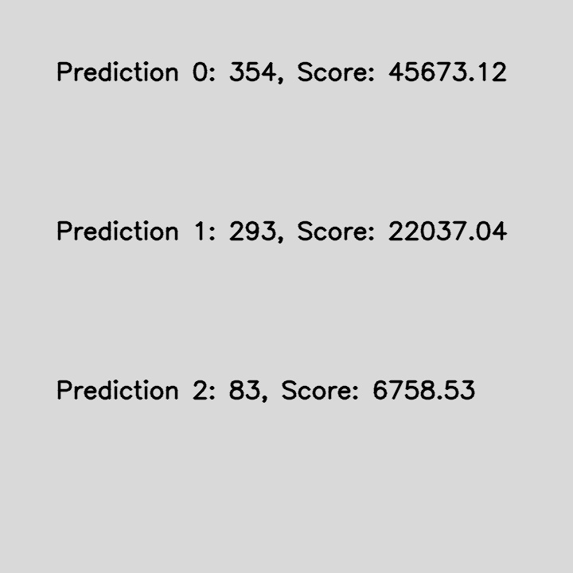

# Model Inference

## Create conda environment

```conda env create -f environment.yml```

## Outline

This repository contains the code for the following:
1. Loading the .pt model using PyTorch
2. Converting the model to ONNX format using PyTorch
3. Model inference using ONNX model
4. Web app for model inference using ONNX model

The web app can be found in **`app/`** directory.

# Web API Instructions

This is a sample flask application that uses Bootstrap for the Frontend UI and PyTorch for model inference.

## How to Use

```bash
conda activate pytorch_inference
python app_chest_xray.py
```

Go to 127.0.0.1:4555 on your browser.

## Test Images
The test images can be found in **`chest_xray_kaggle`** folder.

The test images have been obtained from [Kaggle Chest X-Ray Competition](https://www.kaggle.com/paultimothymooney/chest-xray-pneumonia).

## Output

You should get a screen shown below.

Choose Browse and upload an image. Click Upload to get the output




